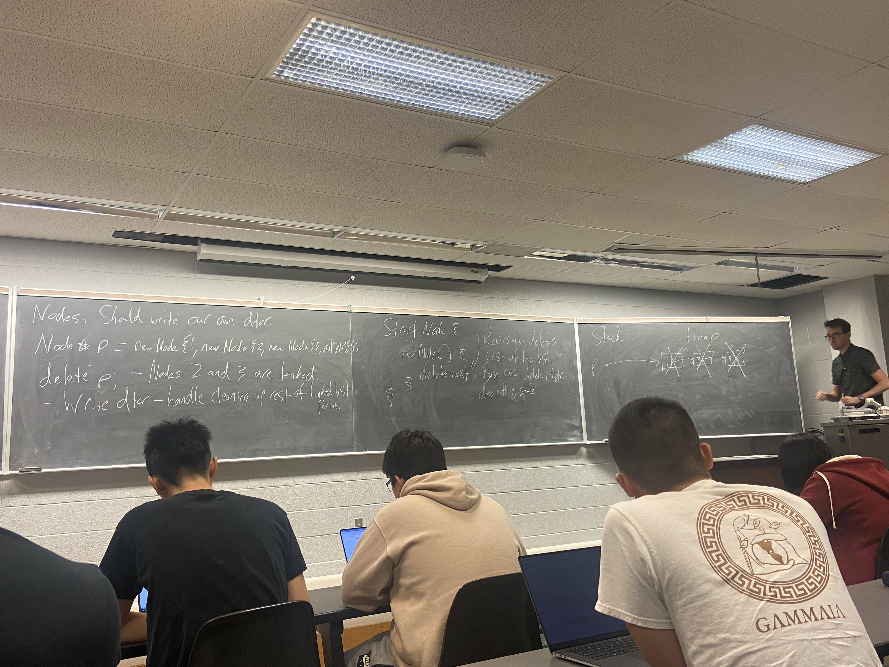
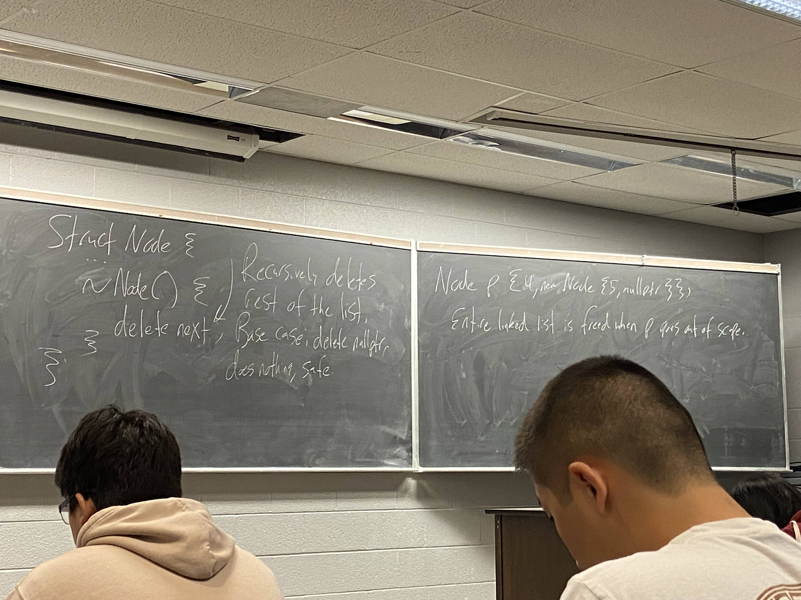

# Last time: 
- MIL, Copy ctor
```c++
struct Node {
    int data;
    Node *next;
    Node(const Node &other):data{other.data}, next{other.next ? new Node{*other.next}: nullptr} {}
};
```

Today:
- Explicit, Dtor, Copy Assignment operator
<br>
Q: Why not Node(Node other)?
<br>
A: Pass-by-value, to call copy ctor, would need to invoke copy xctor infinte loop.

# Note
- Carefull when writing Ctor that can take a single args.

```c++
struct Node{
    Node(int data, Node *next = nullptr) : data{data}, next{next} {};
}

Node n{5, nullptr};
Node m{6};

Node p = 100;   // Implicit Conversion 
// Invokes the single arg ctor for Node
```


```c++
string s = "Hello";     // There is a single arg ctor for string that takes in a cosnt char*
//std::string   const char*
```

```c++
void f(Node n);
f(Node {5});
f(5);  // arg 5 is converted into a node
```

Q: Why might you want to disable this ?
- complier does convertion implicitly
- No waring or indication that the conversion wil occur
- Potential to miss errors
<br>

# Make the ctor explicit:
```c++
struct Node{
    explicit Node(int data, Node *next = nullptr) : data{data}, next{next} {};
};
```

```c++
Node p = 4; // Does not complie
f(4);  // Does not complie
Node p{4};    // will work
f(Node{4});   // will work
```

# Destructors(dtors)
- Runs whenever an object is destroyed.
- when an object goes out of scope (Stack allocated) or when delete is called on a ptr to that object  (Heap allocated)
- Always takes no args

## Compliers provided dtor:

Calls dtor on all object fields. 
<br>

Step of object destruction:
1. dtor body runs
2. object feilds have their dtor's called in reverse declaration order
3. *LATER*
4. Space is deallocated for the object that is destructed






# Copy Assignment Operator

```c++
struct s {60,70, 80};
Student r = s;  //copy ctor
Student t{0, 0, 100};
r = t; //Copy Assignment operator
```

- Assigns one object to another of the same type.
- complier provided copy assignment op; does field-by-field asignment.

```c++
Node n{1, new Node{2 , new Node{3, nullptr}}};
Node p{4, new Node{5, nullptr}};
p = n;  //This will not work and create a memory leak
```

## Chaining
- to support chaining, return type of operator = is Node&
```c++
int a,b,c,d;
a = b = c = d = 100;
// the above expresion will go from right to left and return the variable assigned
// for eg> 1: d =100; returns d; 2: c = d; returns c; ..... till the end 
```

```c++
struct Node{    //Broken
    Node &operator=(const Node &other) {
        delete next;
        data = other.data;
        next = other.next ? new Node{*other.next} : nullptr;
        return *this;
    }
};
```
<br>
It will work for all the cases but not work for a very specific cases:
<br>

```c++
n = n;   //Deletes all our own nodes, then try to copy them
*p = *a;  
arr[i] = arr[i]
//Self assignment occurs, without you realizing.
```
<br>
Self-Assignment Check:

```c++
struct Node{    //Works now
    Node &operator=(const Node &other) {
        if (this == &other) return *this;
        delete next;
        data = other.data;
        next = other.next ? new Node{*other.next} : nullptr;
        return *this;
    }
};
```
<br>
One more improvement: If we request memory with new; there is a chance it may fail. 
So, the better strategy request memory before deleting Nodes
<br>

```c++
struct Node{    
    Node &operator=(const Node &other) {
        if (this == &other) return *this;
        Node *temp = other.next ? new Node{*other.next} : nullptr;
        delete next;
        data = other.data;
        next = temp;
        return *this;
    }
};
// moved the copy part before deleting the next node
```

# Copy and Swap Idiom; Another way of writing copy assignment operator

```c++
std::swap(a,b) //Utility, a gets b's value and viceversa
```

```c++
struct Node{
    void Swap(Node &other){
        std::swap(data, other.data);
        std::swap(next, other.next);
    }

    Node &operator=(const Node &other){
        Node tmp{other};
        Swap(tmp);
        return *this;
    }
}

// works the same way as copy assignment operator
```
