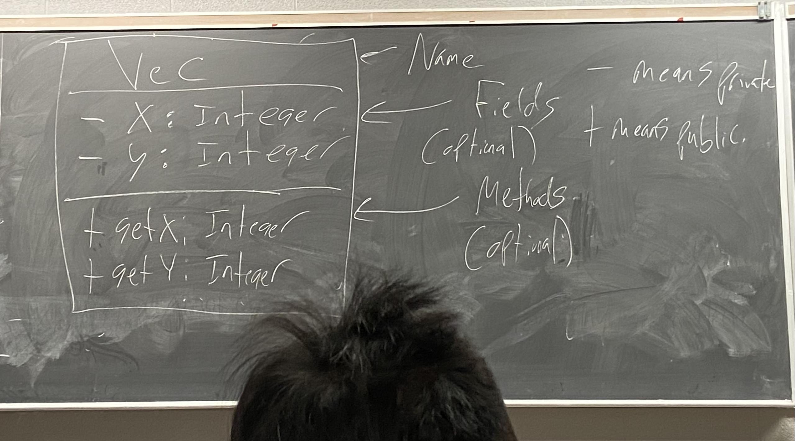
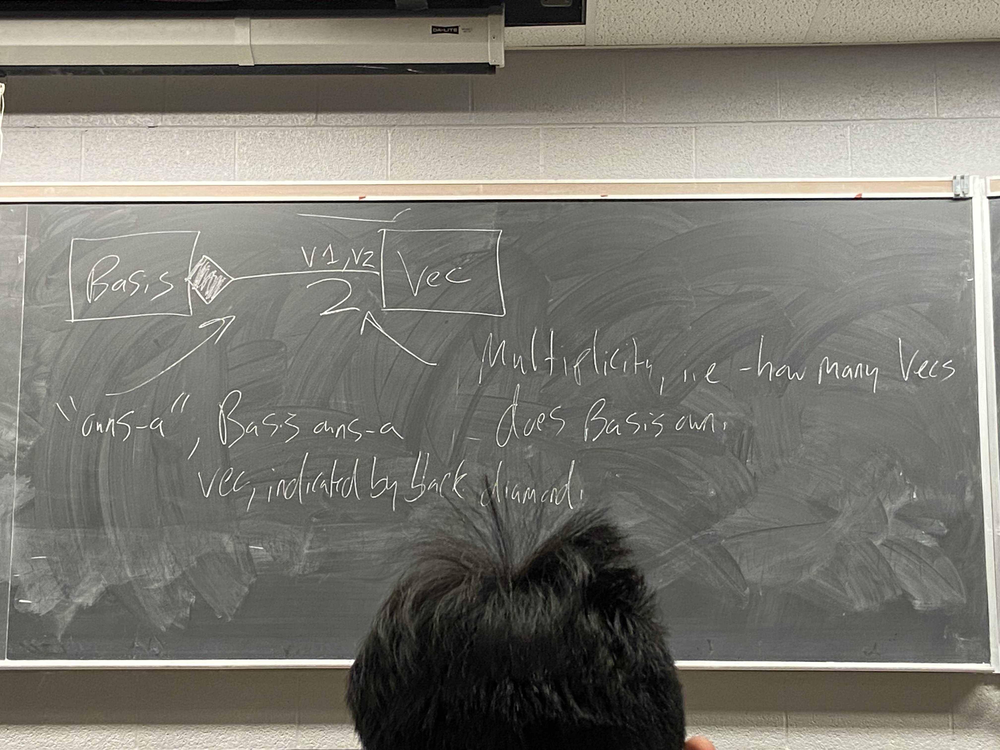

```c++
class List{
    struct Node;
    Node *head;

    public:
        class Iterator{
            Node *cur
            public:
                Iterator(Node *cur) : cur{cur} {}
                Iterator &operator++(){
                    cur = cur->next;
                    return *this;
                }

                bool operator!=(const Iterator &other) const{
                    return cur!= other.cur;
                }
                int &operator*() const{  //correction from last class
                    return cur->data;
                }
        };
        //list class
        Iterator begin() const{
            return Iterator{head};
        }
        Iterator end() const{
            return Iterator{nullptr};
        }
};


int main(){
    List l; l.addToFront(1);

    for(List::Iterator it = l.begin(); it != l.end(); ++it){
        cout << *it << endl;
    }
}
```

If we have the following:
- A class with methods begin and end which returns same "Iterator type"
- This type supports ++, !=, and *
- We get range-based for loop syntax
```c++
for (int n:l){ // copies each int in the list
    cout << n << endl;
}

// If we want modification
for (int &n:l) {
    n *= 2;
    cout << n << endl;
}
```

### Slight encapsulation problem:

```c++ 
List::Iterator it{nullptr};
```
- User should only create Iterators via begin and end.

- Solution: Make Iterators ctor private. Then, user cannot create Iterators. Give List privalged access to call the private constructor.

```c++
class List{
    struct Node;
    Node *head;

    public: 
    class Iterator{
        Node *cur;
        Iterator(Node *cur) : cur{cur} {}

        public:
            friend class List;
            //      ^^ can be placed anywhere in Iterator
    };

    Iterator begin(){
        return Iterator{head};
    }
    Iterator end(){
        return Iterator{nullptr};
    }
};
```
Because Iterator declared List as a friend list may access Iterator's private fields and methods.

- The only way to create iterators is by calling begin and end.
- Carefull: Friends weaken encapsulation. More friends => more classes accessing private fields methods => more difficult to reason about your class.

Rather than making friends - use accessor/mutators; (getters/setters)

```c++
Class vec{
    int x, y;
    Public:
        Vec(int x, int y) : x{x}, y{y} {}
        int getX() const{return x;}
        int getY() const{return y;}
        void setX(int a){x = a;}
        void setY(int b){y = b;}
};
```
What about Operator<< ? Standalone fn, but still want access to private fields.

- Use getX(), getY() if defined.
- Declare a friend fucnction.

```c++ 
class Vec{
    int x, y;
    public:
        Vec(int x, int y) : x{x}, y{y} {}
        int getX() const{return x;}
        int getY() const{return y;}
        void setX(int a){x = a;}
        void setY(int b){y = b;}

        friend std::ostream &operator<<(std::ostream &out, const Vec &v);
};

friend std::ostream &operator<<(std::ostream &out, const Vec &v){
            return out << v.x << " " << v.y;
}
```

- How many times should we use friend? As few as possible mostly 2-3 time max other than istream and ostream.

## Equality revisited
List encasuates Node.
we can now keep track of of extra info about our List, eg: length.

<br>

Strategies to impletement a length method:
1. Iterate through Nodes, count them, return count. - O(n)
2. Keep track of length feilds, increment/decrement when adding/removing nodes. - O(1)

Now: we can optimze spaceship compairsion:

If we were (l1 <=> l2) == 0, This checks if two list are equal. Takes O(n) time.

Shortcut for == compairson: Two list of different length cannot be equal.

```c++
class List{
    Node *head;
    int lengeth;
    public:
        auto operator<=>(const List &other) const{
            if (!head && !other.head) return std::strong_ordering::equal;
            if (!head && other.head) return std::strong_ordering::less;
            if (head && !other.head) return std::strong_ordering::greater;
            return *head <=> *other.head;
        }

        bool operator==(const List &other) const{
            if (length != other.length) return false;
            return (*this <=> other) == 0;
        }
};
```

Now : If we write l1 == l2; we use == operator, more efficient - checks to see if lengths are equal. otherwise, !=, <=, >=, >, <, all use <=> operator. Allows us to optimze quality checks.

## System Modellling:

Write classes and relationships between them in a graphical way. so as to communicate with other programmers. UML Diagrams(Unified Modelling Language).



## Realtionships btw classes:

compostion : Nesting onr object with another.
```c++
class Basis{
    Vec v1, v2; //Vec is composed with basis.
};
```

Generally if class B is composed with class A:
1. If A dies => B dies.
2. If A is copied => B is copied.(Deep copy)
3. B has no identity without A.

Also called as "owns a" relationship.
Basis "owns" two Vec.

<BR>

Implementation: Typically, Done via object fields, although not nessarily.





