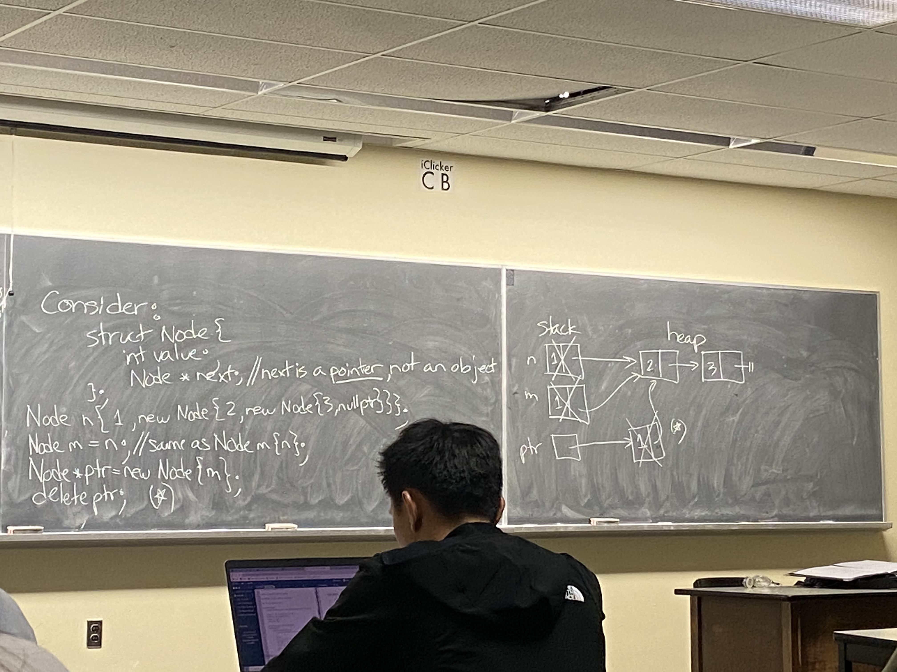
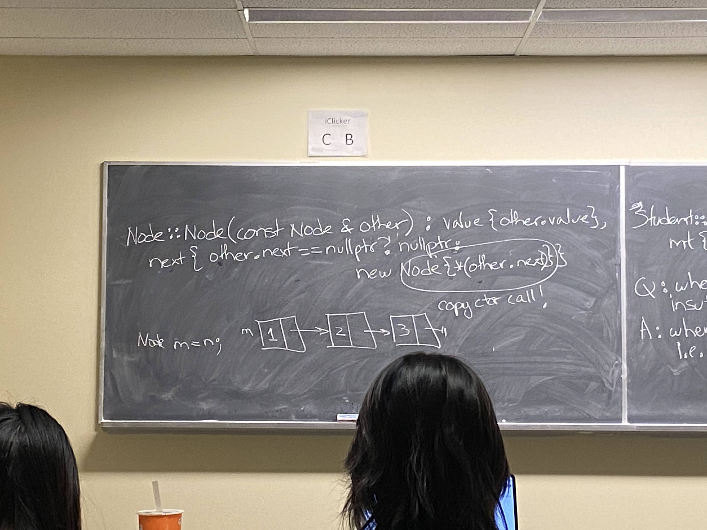

## Notes :

- "student s;" is equivalent to "student s{};"
- "student s{60,70,80};" is equivalnet to "student s = student{60, 70, 80};"
   2nd form form is a "constructor" call not assignment. 
   i.e passes rvlaue student{60, 70, 80}; to ss constructor call  -- later in the course.


## Object Creation Steps:
1. allocate object space.
2. construct feilds => data feilds that are objects need ctors called
3. constructor body runs => Feilds must exist and be initialized


## Use Member Initialization list (MIL):
- Must be used for : refrences, constants, and ctor calls.
- Use the MIL as mush as possible! (CS246 WANTS US TO USE IT MORE)
 ```c++
 struct Basis {
    Vec v1{0,1}, v2{1, 0};
    Basis(){}
    Basis(const Vec &va, const Vec &vb) : v1{va}, v2{vb}, {};
 };
 ``` 

- if data fields is listed in ctors MIL, then we ignore "default inital value" in line
- MIL can only be used for ctor
```c++
struct Student{
    int assns, mt, final;  //not objects
    string name;
    student(int a, int m, int f, const string &n);
};

Student::Student(int a, int m, int f, const string &n) : assns{a}, mt{m}, final{f}, {name =n};
```

1. name default constructed to empty string (Step 2 of object creation)
2. copies n into name(step 3)

- would be more efficient to pass n to name's ctor

## Note:
Compiler initializes data feilds indeclaration order, regardsless of MIL order.
- warning of orders don't match
- USE MIL AS MUCH AS POSSIBLE ON ASSIGNMENTS, EXAMS EVERYWHERE!!

```c++
Student::Student(int a, int m, int f, const string &n) : assns{a}, mt{m}, final{f}, name{n} {}; 
// {} is ctor body (step 3).
// everything before that is step 2.
```

## Consider
```c++
Basis::Basis(const Vec &v1, const Vect &v2) : v1{v1}, v2{v2} {};
```
What is the ctor call for v1(or v2) ?
- This is COPY CONSTRUCTOR, complier gives you one if you don't define it.

```c++
Student Fred{75, 80, 99, "Fred"};
Student Fredz = Fred;  // same as "Student fredz{Fred};"
```
- Default copy ctor:
     - Field by field Id copy for non-object
     - copy ctor for oject data fields

FORM:
```c++
 <classname>(const <classname> & );
```

for eg: 
```c++ 
Student (const Student & s);
```

Q: what methods does the complier provide for your class if you dont't provide them?
<br>
A: default constructor(o-parameters)
   copy constructor
   move constructor
   destructor
   copy assignment
   move assignment

   These are called Big 5 - More on this later on the course.

```c++
Student::Student(const Student &other): 
   assns{other.assns}, 
   mt{other.mt}, 
   final{other.final},
   name{other.name} {};
```

Q: When is the default copy action insufficient? 
<br>
A: When "shallow" copy isn't good enough i.e: want "deep" copy.

### CONSIDER
```c++
Struct Node{
   int value;
   Node *next;
};

Node n{1, new Node{2, new Node{3, nullptr}}};
Node m = n; //same as Node m{n};
Node *ptr = new Node{m};
delete ptr; 
//delete doesnt put the value of pointer to NULL it just frees the space

```



```c++
Node::Node(const Node &other): 
   value{other.value},
   next{other.next==nullptr ? nullptr: new Node{*(other.next)}} {}
   // Node{*(other.next)} -> copy ctor call! -> deep copy, we dont want shallow copy for complex objects like this
```



Q: When do copy ctor get called?
<br>
A: For now:
     - When pass or return objects by value
     - explicitly calling copy ctor as parts of declaration eg. Node n{m}

Aside: elision changes this!

Q: Why is this wrong?
Node::Node(Node other) ... ?
<br>
A: passed by value , not refrence attempts to copy Node but trying to implement copy ctor!